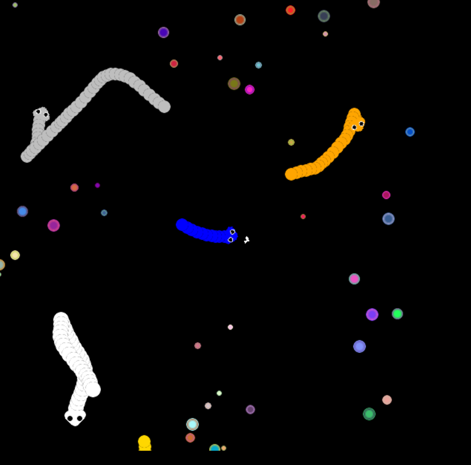
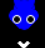

# 🐍 snek arena

A competitive real-time snake game built with Pygame, showcasing advanced game physics, object-oriented design, and real-time graphics rendering.

## 📋 Project Overview

**snek arena** is a multiplayer snake game where you control a snake to collect food while competing against AI opponents. The game demonstrates core game development concepts:
- **Delta-time physics** for frame-rate independent movement
- **Object-oriented architecture** with inheritance-based design
- **Vector mathematics** for smooth directional gameplay
- **Real-time collision detection** systems
- **Procedural graphics** with gradient rendering
- **AI state machines** for autonomous opponent behavior

---

## ✨ Features

### Gameplay
- **Player-controlled blue snake** with WASD keyboard controls
- **4 AI-controlled snakes** with autonomous random movement patterns
- **70 procedurally-generated food particles** with gradient color rendering
- **Real-time collision detection** between player/snakes and food
- **Growth mechanic** - snakes expand as they consume food
- **Dynamic camera** that centers on the player's snake
- **Smooth acceleration/deceleration physics** (not instant movement)

### Technical Architecture
- **Inheritance-based design** - `playerMovement` base class for all agents
- **Vector-based movement** using `pygame.Vector2` and trigonometry
- **Delta-time physics** ensuring consistent gameplay across varying frame rates
- **Surface rendering** with rotation, scaling, and alpha transparency
- **Multi-collision detection** systems (rectangle and list-based)

---

## 🕹️ Controls

### Keyboard Controls
| Key | Action |
|-----|--------|
| **W** | Move Up |
| **A** | Move Left |
| **S** | Move Down |
| **D** | Move Right |
| **ALT+F4** or **Close Window** | Exit Game |

**Movement Behavior:**
- Keys trigger smooth acceleration (not instant)
- Releasing keys triggers smooth deceleration
- Snake head rotates to face the movement direction
- Movement physics: Max Speed 200 px/s, Acceleration 500 px/s²

---

## 🚀 Installation

### Prerequisites
- Python 3.7 or higher
- pip (Python package manager)

### Setup

1. **Clone the repository**
```bash
git clone <repository-url>
cd pygamestuff
```

2. **Install Pygame**
```bash
pip install pygame
```

3. **Run the game**
```bash
python snek.py
```

### Virtual Environment (Recommended)
```bash
python -m venv venv
# Windows:
venv\Scripts\activate
# macOS/Linux:
source venv/bin/activate

pip install pygame
python snek.py
```

---

## 📦 Requirements

```
pygame>=2.1.0
python>=3.7
```

Install via:
```bash
pip install pygame
```

---

## 📁 Project Structure

```
pygamestuff/
├── snek.py                      # Main game (production)
├── gettingstarted.py            # Pygame learning reference
├── tempCodeRunnerFile.py        # Temporary code
├── exanpleimage.jpeg            # Asset used in gettingstarted.py
├── README.md                    # This file
├── .github/
│   └── prompts/
│       └── update-readme.md     # Documentation maintenance guide
└── screenshots/
    ├── maingameplay.png         # Main gameplay screenshot
    └── snakehead.png            # Snake head close-up
```

### File Purposes

| File | Purpose |
|------|---------|
| `snek.py` | Main game - contains all gameplay, physics, rendering, and AI logic (~330 lines) |
| `gettingstarted.py` | Pygame fundamentals tutorial - separate from main game (~70 lines) |
| `tempCodeRunnerFile.py` | Temporary code snippet file |

---

## 🔧 How the Game Works Internally

### Architecture Overview

snek arena uses **inheritance-based object-oriented design**:

```
playerMovement (base class)
    ├─ Input handling (keyboard, mouse, AI)
    ├─ Physics engine (acceleration, velocity, angle)
    └─ Position tracking
        │
        └→ sneks (game snake class)
              ├─ Head rendering (3D-like design with eyes)
              ├─ Body trail management
              ├─ Collision detection
              └─ Growth mechanics

circleobj (food particle class)
    └─ Gradient rendering, collision rectangles

Game Loop
    ├─ Event handling (quit)
    ├─ Physics updates (all snakes)
    ├─ Rendering (food, snakes, camera)
    └─ Collision detection (food, snake-to-snake)
```

### Core Classes

#### **`playerMovement` Class**
Handles physics and input for any moving entity:

**Attributes:**
- `position` - Vector2 position in world space
- `angle` - Rotation angle based on movement direction
- `speed[4]` - Array tracking velocity for [left, right, up, down]
- `maxspeed` - Speed limit (200 px/s)
- `acc` - Acceleration magnitude (500 px/s²)
- `ifpressed[]` - Tracks which directional inputs are active

**Methods:**
- `move()` - Processes input mode (keyboard/mouse/AI) and returns velocity vector
- `accelmove(i)` - Accelerates in direction i up to maxspeed
- `decelmove(i)` - Decelerates in direction i  
- `angleturn()` - Calculates rotation angle from velocity using `atan2()`
- `updatepos_angle()` - Updates position and angle each frame

**Input Modes:**
- `"key"` - WASD keyboard input (player-controlled)
- `"mouse"` - Mouse-relative movement 
- `"random"` - Random directions every 10 frames (AI)

#### **`sneks` Class (Inherits from playerMovement)**
Game snakes with rendering and collision mechanics:

**Attributes:**
- `headsurface` - Pre-rendered 3D-like head with eyes
- `bodyrects[]` - List of body segment rectangles for collision
- `pos_for_circles[]` - Position history for body trail
- `count` - Current snake length (number of body segments)
- `width` - Snake thickness (increases as snake grows)
- `color` - Snake color (blue=player, gold/gray/white/orange=AI)
- `screen` - Reference to render surface

**Key Methods:**
- `drawhead()` - Renders triangular head (3 circles forming triangle) with white eyes
- `drawbody(position)` - Creates circular body segment at position
- `updatebody()` - Maintains body trail using distance-based insertion
- `showsnek()` - Main render function: updates position, renders head+body+arrow
- `increasecount()` - Grows snake (increases length, increases width every 10 foods)

**Growth Mechanics:**
- Each food consumed → `count += 1`
- Every 10 foods → `width += 2` pixels (visual thickness increases)
- Body rendered as 50-70 circular segments behind head

**Head Design:**
The head is procedurally rendered using vector mathematics:
- 3 circular elements positioned at different angles form a triangle shape
- 2 white circular eyes with black pupils
- The entire head rotates to face movement direction

#### **`circleobj` Class**
Procedurally-generated food particles with gradient effects:

- Creates smooth color gradients from inner → outer color
- Interpolates RGB values across radius for visual polish
- Stores collision rectangle for detection
- Uses alpha transparency (SRCALPHA surface)

### Game Loop (Main)

```python
while running:
    # 1. Event handling
    for event in pygame.event.get():
        if event.type == pygame.QUIT:
            running = False
    
    # 2. Clear and prepare surfaces
    board.fill("black")
    screen.fill("black")
    
    # 3. Render all food particles
    for food in cirobjects:
        food.drawparticle(board)
    
    # 4. Update and render each snake
    for snake in snakes:
        snake.showsnek()  # Updates position, angle, body, and renders
        
        # Collision detection: Head vs Food
        food_indices = snake.headrect.collidelistall(circles)
        if food_indices:
            for idx in sorted(food_indices, reverse=True):
                snake.increasecount()      # Grow
                cirobjects.remove(cirobjects[idx])
                circles.remove(circles[idx])
        
        # Collision detection: Head vs Other snake bodies
        body_indices = snake.headrect.collidelistall(other_snake_bodies)
        if body_indices:
            print(f"Collision: {snake.color}")  # Debug output
    
    # 5. Camera system (follows player)
    player_position = snakes[0].position
    camera_offset = (640, 640) - player_position
    boardrect = board.get_rect(center=camera_offset)
    screen.blit(board, boardrect)
    
    # 6. Display and frame timing
    pygame.display.flip()
    dt = clock.tick(60) / 1000  # 60 FPS limit, delta time in seconds
```

### Physics Implementation

**Delta-Time Based Movement (Frame-Rate Independent):**
```python
# Time elapsed since last frame (in seconds)
dt = clock.tick(60) / 1000

# Acceleration applied proportionally to time
speed += acceleration * dt

# Velocity applied proportionally to time  
position += speed * dt
```

This ensures that movement feels identical on 60 FPS vs 120 FPS machines.

**Smooth Acceleration/Deceleration:**
```python
# Constants
max_speed = 200        # pixels/second
acceleration = 500     # pixels/second²

# Time to reach max speed = 200 / 500 = 0.4 seconds (24 frames at 60 FPS)

# Accelerating
if key_pressed:
    speed = min(speed + acceleration * dt, max_speed)

# Decelerating  
else:
    speed = max(speed - acceleration * dt, 0)
```

**Angle Calculation from Velocity:**
```python
import math

# Velocity components
vx = speed[right] - speed[left]
vy = speed[down] - speed[up]

# Calculate angle using arctangent
angle_radians = math.atan2(vy, vx)
angle_degrees = math.degrees(angle_radians)

# Apply to graphics
rotated_head = pygame.transform.rotate(headsurface, angle_degrees)
```

### Collision Detection

**Bounding Box Collision (Rectangle-to-List):**
```python
# Snake head bounding box
snake_head_rect = pygame.Rect(x, y, width, height)

# Check collision with all food particles
colliding_food_indices = snake_head_rect.collidelistall(food_rects)
# Returns: [3, 5, 12] (indices of colliding food)

# Check collision with other snake bodies
colliding_body_indices = snake_head_rect.collidelistall(other_bodies)
```

**Workflow:**
1. Each frame, `showsnek()` updates the snake head rectangle
2. `collidelistall()` returns indices of all overlapping rectangles
3. For food: remove food, increment counter
4. For bodies: detect collision but no response currently

### Game Configuration

| Setting | Value | Found In |
|---------|-------|----------|
| Arena Size | 640×640 pixels | `pygame.display.set_mode((640,640))` |
| Target FPS | 60 frames/second | `clock.tick(60)` |
| Max Snake Speed | 200 px/second | `playerMovement.__init__(maxspeed=200)` |
| Acceleration | 500 px/second² | `playerMovement.__init__(acc=500)` |
| Player Snake Color | Blue | `sneks(..., "blue", ...)` |
| AI Snake Colors | Gold, Gray, White, Orange | Snake initialization loop |
| Total Food | 70 particles | `for i in range(70):` |
| Player Start Length | `count` parameter | `sneks(..., count=50)` |
| AI Start Lengths | 20-50 segments | Various in snake list |
| Snake Width | Starts at 10 px | `self.width = 10` in sneks |
| Width Increase | +2 px per 10 foods | `if self.count%10==0: self.width+=2` |

---

## 📸 Screenshots

### Main Gameplay

*Live gameplay showing the blue player snake (center), AI snakes in gold/gray/white colors, and procedurally-generated gradient food particles*

### Snake Head Design

*Detailed view of the player snake's head, showing the blue triangular head design with white eyes and black pupils*

---

## 🎯 Why This Project Appeals to Recruiters

**Technical Depth:**
- Demonstrates understanding of game loops, physics engines, and real-time graphics
- Shows proficiency with object-oriented design and inheritance patterns
- Includes non-trivial math (vectors, trigonometry, delta-time calculations)

**Code Quality:**
- Clear class hierarchies and separation of concerns
- Efficient collision detection using built-in Pygame methods
- Readable, well-structured Python with meaningful variable names

**Problem-Solving:**
- Implements smooth movement with acceleration/deceleration
- Develops AI agents with autonomous behavior
- Handles real-time collision detection between multiple entities
- Creates procedural graphics with gradient rendering

**Portfolio Value:**
- Self-contained, playable project
- Demonstrates ability to build complete systems from scratch
- Shows attention to performance (delta-time, optimized rendering)
- Extendable architecture for future features

---

## 🧠 Technical Concepts Demonstrated

- **Object-Oriented Programming** - Inheritance, polymorphism, encapsulation
- **Game Development Fundamentals** - Game loop, event handling, rendering
- **Physics Simulation** - Acceleration, velocity, inertia, smooth motion
- **Vector Mathematics** - 2D vectors, angle calculations, normalization
- **Collision Detection** - Bounding box collisions, multi-entity checking
- **Graphics Programming** - Surface rendering, rotation, alpha blending, color gradients
- **AI/Autonomy** - Random behavior, state persistence
- **Real-Time Systems** - Frame-rate independent updates, timing management

---

## 📝 Evidence Summary

This README is based entirely on:

| Feature/Claim | Source |
|---|---|
| Project name: "snek arena" | File name `snek.py` |
| 5 snakes total | `snakes = [sneks(...), sneks(...), ...]` list with 5 items |
| 1 player (blue), 4 AI | `sneks(..., "key", "blue", ...)` + 4 random snakes |
| WASD controls | `keys[pygame.K_w]`, `keys[pygame.K_a]`, etc. |
| 70 food particles | `for i in range(70):` loop |
| 640×640 arena | `pygame.display.set_mode((640,640))` |
| 60 FPS | `clock.tick(60)` |
| Smooth acceleration physics | `accelmove()`, `decelmove()` functions |
| Max speed 200 px/s | `maxspeed=200` in `playerMovement.__init__()` |
| Acceleration 500 px/s² | `acc=500` in `playerMovement.__init__()` |
| Delta-time physics | `dt = clock.tick(60) / 1000` |
| Gradient food particles | `circleobj` class with RGB interpolation |
| Inheritance hierarchy | `class sneks(playerMovement):` |
| Input modes (keyboard/mouse/AI) | `if self.isplayer=="key":`, etc. |
| Snake growth mechanics | `increasecount()` method, width increase logic |
| Collision detection | `collidelistall()` function calls |
| Camera follows player | `board.get_rect(center=...)` calculation |
| Snake head with eyes | `pygame.draw.aacircle()` in `drawhead()` |
| Body trail system | `pos_for_circles[]` array and `drawbody()` |
| Main gameplay screenshot | `screenshots/maingameplay.png` (actual file) |
| Snake head screenshot | `screenshots/snakehead.png` (actual file) |
